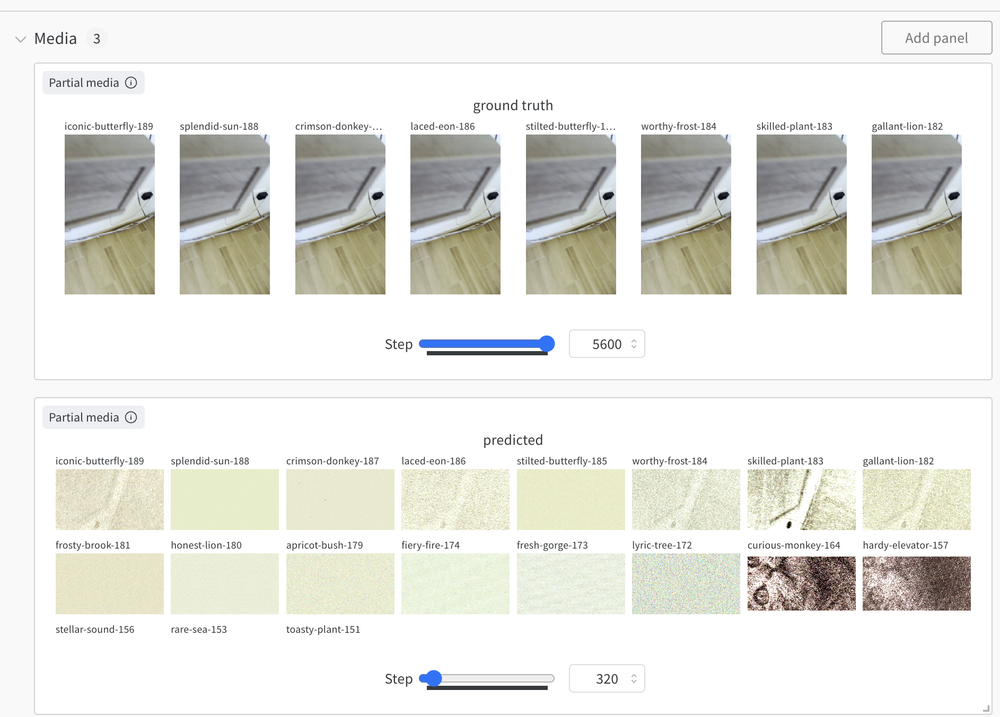

## Nerf From Scratch

A bunch of code to practice implimeting NERF papers from scratch and learn their details

(NOTE: This readme is no longer developed, Pushing up all existing changes in case there is some learnings to be shared, but mostly thi was a scratch pad)


#### Goal:

Be able to run a single script

```
train.py --video demo.mp4
```

Allow training of a video NERF in 50-60 seconds that allows high quality video stylization

#### Current State

Currently the code is not running as a did a major overhaul to add all the features below.

#### Models

- [x] Explore Transformers instead of MLPs(NOTES: Data hungry and slow, is more smooth and better results with more compute)
- [x] Add fast mobile transformer instead of MLP[In progess, code is in repo haven't tested on NERFs)(Probably ditch this in favor of lookup tables)
- [x] Lookup table inspired by instantNGP
- [x] Add spacetime lookup tables

#### Expand Spacetime Handling

- [x] Add Space time geometry projection to project arbitrary scene geometry to cube based 3D lookup tables (Geometric Projection to lookup table index)
- [x] Lookup neighbors in lookup table for more scene information in space and time directions

#### Video

- [x] Add a timestep variable
- [x] Enhance sampling for low-quality videos
  - [x] No camera coords or direction required(Learn positon and direction vectors per image)
  - [x] Implement deblurring using a transformer model
  - [x] Prioritize learning from clear frames
  - [x] Increase focus on edges within frames
  - [x] Favor frames with significant changes to minimize redundancy

#### Training Stability

- [x] Add Loss term on model estimated depth, This allows us to take advantage of a pretraineds foundation models and bootstrap training
- [x] Add exponential time series sampling(samples runs of 9 steps at (-8, -4, -2, 1, 0, 1, 2, 4, 8) sampling effective near and long range time information

#### Style Controls

- [x] CLIP based pixel style loss
- [x] CLIP based geometry style loss on depth maps[1]

### Feature learning for editing

- [x] Adds a clip grounded pixel based loss for tying semantic information to editing (TOOD: Add ref)

#### Training Speedups

- [x] Shoot more rays at edges in images (TODO: Add paper ref)
- [x] Regularize loss over empty space from InfoNERF(ignore KL loss from infoNERF)
- [x] Use fast lookup tables inspired by nvidia Instant NGP
- [] (TODO): Use actual CUDA kernels from instant-NGP(Although these won't be spacetime compatible)(The torch tables may be fast enough)

[1] https://hyblue.github.io/geo-srf/

### Logs

Logs are currently going to weights and biases logs here:

NOTE: Theses are small test runs to validate the code is working. Have not scaled this up to longer videos yet.

https://wandb.ai/nbardy-facet/3D_nerf


